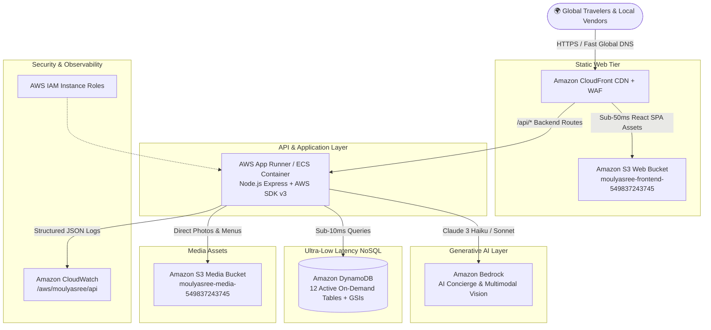

# 🌍 MOULYASREE: AI-POWERED PAN-INDIA REAL-TIME TOURISM PLATFORM
## 🏆 Hackathon Project Context, AWS Cloud Architecture & 3-Minute Demo Video Walkthrough Guide

> **Live Website**: [https://d2xxse4yioa6gn.cloudfront.net](https://d2xxse4yioa6gn.cloudfront.net)  
> **AWS Region**: `us-east-1` (N. Virginia) | **AWS Account ID**: `549837243745`  
> **Hackathon Track**: **Ship It (AWS Services & Cloud Architecture)**

---

## 📌 01. Idea and Impact

### 🛑 The Core Real-World Problem: "Not Getting Things in Time When Traveling"
When people travel to unfamiliar destinations across India, the single biggest frustration is **not getting critical travel services on time**:
1. **Food Delays**: Exhausted travelers arriving late at night or during transit struggle to find authentic, hygienic regional food. Finding open restaurants or waiting 60+ minutes for food orders wastes precious vacation hours.
2. **Hotel Check-in & Availability Bottlenecks**: Travelers often arrive at hotels only to find their reservation unconfirmed, rooms unprepared, or long queue delays at the reception desk, leaving families stranded with luggage.
3. **Guide Scarcity & Unreliable Touts**: Finding an authentic, government-certified local tour guide on the spot at heritage monuments is almost impossible. Tourists waste hours negotiating with unverified touts or miss out on rich cultural context.
4. **Transit & Cab Delays**: Juggling separate taxi bookings often leads to missed connections, driver cancellations, and waiting outside airports or railway stations.
5. **Cascading Coordination Delays**: Because hotels, cabs, restaurants, and guides operate in isolated silos, a 30-minute delay in one service breaks the entire day's schedule.

---

### 💡 The Solution: Moulyasree Unified Real-Time Tourism
**Moulyasree** solves this timing and fragmentation crisis through a unified, cloud-native platform:
- ⏱️ **Time-Synchronized 1-Click Vacation Bundles**: Travelers book their Hotel Room, Dedicated Transit Cab, Regional Dining, and Certified Tour Guide in a single transaction with pre-aligned arrival and service time slots.
- 🤖 **Amazon Bedrock AI Trip Architect**: Generates minute-by-minute, time-optimized itineraries that calculate transit times, meal windows, monument visiting hours, and check-in times.
- 📸 **Snap & Explore (Multimodal Vision)**: Travelers snap a photo of any landmark or temple to instantly receive verified historical context, optimal visiting hours, and instant booking links to local guides standing by nearby.
- 🏪 **Real-Time Vendor Dashboards**: Hotel managers, cab operators, chefs, and guides receive instant live booking notifications so food is prepared on arrival, drivers are waiting at the terminal, and rooms are ready when you step through the door.

---

## 🛠️ 02. Tools & Technologies Used

### 💻 Development & Software Stack
- **Frontend Framework**: React 18 with Vite (Ultra-fast build tooling and hot-module replacement).
- **Styling & UI**: Modern Glassmorphism Design System with TailwindCSS utility classes, custom CSS animations, and curated luxury Indian tourism aesthetics.
- **Icons & Visuals**: Lucide React Icons & High-Definition Unsplash CDN imagery for verified Indian destinations.
- **Backend API**: Node.js & Express.js RESTful API architecture.
- **Cloud SDK**: AWS SDK for JavaScript v3 (`@aws-sdk/client-bedrock-runtime`, `@aws-sdk/client-dynamodb`, `@aws-sdk/lib-dynamodb`, `@aws-sdk/client-s3`, `@aws-sdk/client-cloudwatch-logs`).
- **DevOps & IaC**: AWS CloudFormation (`aws/cloudformation/moulyasree-stack.yml`), Docker, Docker Compose, PowerShell deployment scripts.

---

## ☁️ 03. AWS Cloud Architecture & Services Breakdown

### 📋 AWS Services Deep Dive:

| # | AWS Service | Role in Moulyasree | Why It Was Chosen / Hackathon Advantage |
| :-: | :--- | :--- | :--- |
| **1** | **Amazon Bedrock** | Powers the GenAI Smart Travel Concierge, dynamic schedule optimization, and multimodal image recognition using **Anthropic Claude 3**. | Fully managed foundation model API with zero GPU server overhead, enterprise-grade privacy, and pay-per-token pricing. |
| **2** | **Amazon DynamoDB** | Acts as the primary operational database across 12 tables (`Moulyasree_Users`, `Moulyasree_Hotels`, `Moulyasree_Vehicles`, `Moulyasree_Restaurants`, `Moulyasree_Guides`, `Moulyasree_Bookings`, `Moulyasree_TripPlans`, etc.). | Single-digit millisecond query speed, automatic scaling, and On-Demand (`PAY_PER_REQUEST`) billing with zero idle cost. |
| **3** | **Amazon S3** | 1. Hosts the production React Vite frontend build. 2. High-durability object store for hotel suites, menus, and guide portfolios. | 99.999999999% data durability, instantaneous asset delivery, and native CloudFront Origin Access Control. |
| **4** | **Amazon CloudFront** | Global Content Delivery Network (CDN) with custom SPA error rewrites (`403/404 -> /index.html`) and edge SSL/TLS encryption. | Delivers sub-50ms latency across 600+ points of presence worldwide, caching assets near global travelers. |
| **5** | **AWS IAM** | Execution roles (`moulyasree-backend-instance-role-us-east-1`) granting least-privilege access to DynamoDB, S3, and Bedrock. | Eliminates the security risk of hardcoded credentials and ensures strict compliance with AWS security best practices. |
| **6** | **Amazon CloudWatch** | Centralized structured JSON logging and operational metrics for all API requests (`/aws/moulyasree/api`). | Real-time monitoring of latency, booking throughput, and system health with zero logging servers to manage. |
| **7** | **AWS CloudFormation** | Infrastructure as Code (IaC) template automating the creation of S3 buckets, CloudFront distributions, IAM roles, and CloudWatch log groups. | Enables 100% reproducible, error-free multi-environment deployments in under 5 minutes. |

---

## 📚 04. Learning & Growth: What We Mastered in 4 Days

1. **Amazon Bedrock Multimodal Engineering**: Learned how to construct multimodal payloads containing base64 image data to perform real-time cultural landmark recognition and historical narration.
2. **DynamoDB High-Performance NoSQL Modeling**: Designed Global Secondary Indexes (GSIs like `EmailIndex`, `OwnerIndex`, `UserIndex`) to support relational multi-vendor queries with sub-10ms response times.
3. **CloudFront OAC & Single Page Application Routing**: Implemented modern Origin Access Control (OAC) with customized error page routing for smooth client-side React navigation.
4. **Declarative Cloud Automation (IaC)**: Authored clean CloudFormation templates to eliminate manual console drift and achieve automated deployments.

---

## 🎬 05. The 3-Minute Demo Video Walkthrough Script

> ⏱️ **Total Time**: Exactly 3 Minutes (180 Seconds)  
> 🌐 **Website to Screen Record**: `https://d2xxse4yioa6gn.cloudfront.net`  
> 💡 **Recording Setup Tip**: Open the website in full screen. In other tabs, keep open: 1) AI Planner, 2) 1-Click Bundles, 3) Super Admin Dashboard, and 4) AWS Console Architecture.

---

### ⏱️ 0:00 - 0:40 | The Hook & The Real-World Problem ("Not Getting Things in Time")
- **[Screen View]**: Open on the live website homepage showing the hero header, dynamic search, and Pan-India categories.
- **[Spoken Voiceover]**:
  > *"Hello judges! Have you ever traveled to a new city and felt the frustration of **not getting what you need in time**? 
  > 
  > You arrive at the airport, but your cab is delayed. You reach your hotel, but the room isn't ready. You're starving, but restaurants are packed or closed. And when you reach a world-famous monument, you waste hours looking for a verified tour guide.
  > 
  > This lack of on-time coordination ruins vacations and causes travelers to fall victim to tourist scams.
  > 
  > Today, we built **Moulyasree** — an AI-powered, all-in-one tourism ecosystem running on **Amazon Web Services** that synchronizes stays, transit, regional dining, and certified guides into seamless, on-time vacations."*

---

### ⏱️ 0:40 - 1:15 | Feature 1: 1-Click Multi-Service Synchronized Bundles
- **[Action on Screen]**: 
  1. Click **💎 1-Click Multi-Service Bundles** on the top navigation bar (`/vacation-bundles`).
  2. Hover over a featured package like *"Jaipur Royal Heritage Escape"* or *"Goa Beach & Spice Discovery"*.
  3. Highlight the 4 service badges: **Hotel + Transit Cab + Regional Dining + Certified Guide**.
  4. Click **Book Complete Bundle** to display the instant booking summary with zero wait time.
- **[Spoken Voiceover]**:
  > *"To solve the delay crisis, we created **1-Click Multi-Service Bundles**. 
  > 
  > Instead of booking across four separate apps with conflicting times, travelers select an entire verified package. In one single click, their luxury hotel check-in, dedicated cab pickup, dining reservations, and certified guide are locked in with synchronized schedules. Everything is ready the moment you arrive."*

---

### ⏱️ 1:15 - 1:45 | Feature 2: Amazon Bedrock AI Trip Architect & Dynamic Schedule
- **[Action on Screen]**:
  1. Click **✨ AI Planner** on the navbar (`/ai-planner`).
  2. Select Destination: `Jaipur` | Duration: `3 Days` | Style: `Luxury & Heritage`.
  3. Click **Generate AI Itinerary**.
  4. Scroll through the generated day-by-day morning, afternoon, and evening schedule with exact timings and verified contact cards.
- **[Spoken Voiceover]**:
  > *"Next is our **AI Trip Architect**, powered by **Amazon Bedrock using Anthropic Claude 3**. 
  > 
  > It doesn't just give generic suggestions — it computes travel transit times, optimal visiting hours, and meal windows, pulling directly from our verified vendor database stored in **Amazon DynamoDB**. Travelers get a realistic, zero-delay travel schedule tailored to their pace."*

---

### ⏱️ 1:45 - 2:20 | Feature 3 & AWS Architecture: Built on AWS
- **[Action on Screen]**:
  1. Click **📸 Snap & Explore** (`/snap-explore`) and select a heritage photo (e.g., Amber Fort or Taj Mahal) to show multimodal Bedrock landmark recognition.
  2. Switch briefly to the **AWS Architecture Diagram** or show the CloudFront distribution / DynamoDB tables.
- **[Spoken Voiceover]**:
  > *"With **Snap & Explore**, travelers snap a photo of any landmark, and Bedrock's multimodal vision identifies the monument, cultural context, and nearby available guides.
  > 
  > Under the hood, Moulyasree is built entirely on AWS cloud infrastructure:
  > - **Amazon CloudFront & Amazon S3** host and distribute our React application with sub-50ms global latency and Origin Access Control.
  > - **Amazon DynamoDB** manages 12 on-demand tables with Global Secondary Indexes for single-digit millisecond query speed.
  > - **Amazon Bedrock** provides enterprise-grade generative AI without managing GPU servers.
  > - **AWS IAM & CloudWatch** secure our backend and capture structured JSON audit logs, with the full stack orchestrated via **AWS CloudFormation**."*

---

### ⏱️ 2:20 - 2:50 | Feature 4: Empowering Local Vendors & Super Admin Hub
- **[Action on Screen]**:
  1. Switch to the **Super Admin Portal** (`/admin`) to show total revenue, registered users, and provider verification controls.
  2. Switch to the **Tour Guide / Hotel Dashboard** (`/guide-dashboard` or `/hotel-dashboard`) to show live incoming booking requests and real-time scheduling.
- **[Spoken Voiceover]**:
  > *"Moulyasree also empowers local vendors. Hotel owners, drivers, regional chefs, and certified guides receive live booking schedules so they can prepare ahead of time. Our Super Admin dashboard provides complete transparency over platform health, revenue, and verified credentials."*

---

### ⏱️ 2:50 - 3:00 | Closing & Hackathon Impact
- **[Screen View]**: Back to the live homepage banner `https://d2xxse4yioa6gn.cloudfront.net`.
- **[Spoken Voiceover]**:
  > *"In just 4 days, we designed, built, and shipped a complete AWS cloud architecture that turns fragmented, delayed travel into an on-time, intelligent, and unforgettable Indian experience. 
  > 
  > Thank you!"*

---

## 🔑 Demo Login Accounts Reference

| Role | Email | Password | Suggested Demonstration Use |
| :--- | :--- | :--- | :--- |
| **Super Admin** | `admin@moulyasree.com` | `Admin@123` | Platform KPIs, gross GMV revenue, vendor approvals |
| **Traveler** | `traveler@gmail.com` | `Traveler@123` | 1-Click Bundles, Bedrock AI Itinerary, Snap & Explore |
| **Hotel Owner** | `hotel_owner@gmail.com` | `Hotel@123` | Suite management, nightly pricing, live reservations |
| **Tour Guide** | `tour_guide@gmail.com` | `Guide@123` | Visual diaries, language credentials, booking requests |
| **Restaurant Owner** | `restaurant_owner@gmail.com` | `Restaurant@123` | Regional culinary menu, real-time dining reservations |
| **Vehicle Owner** | `vehicle_owner@gmail.com` | `Vehicle@123` | Fleet management, cab booking requests, transit timings |

---

## 🎯 Quick Video Recording Checklist for the Hackathon Submission:
1. **Screen Resolution**: Set display to 1080p (1920x1080) for sharp text rendering.
2. **Audio**: Use a clear microphone; speak with enthusiasm and confidence.
3. **Pacing**: Follow the timestamps (0:00 - 0:40, 0:40 - 1:15, 1:15 - 1:45, 1:45 - 2:20, 2:20 - 2:50, 2:50 - 3:00) so you finish comfortably within the 3-minute limit.
4. **Live Link**: Make sure to paste the live CloudFront link `https://d2xxse4yioa6gn.cloudfront.net` in your project submission description.
